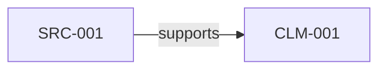
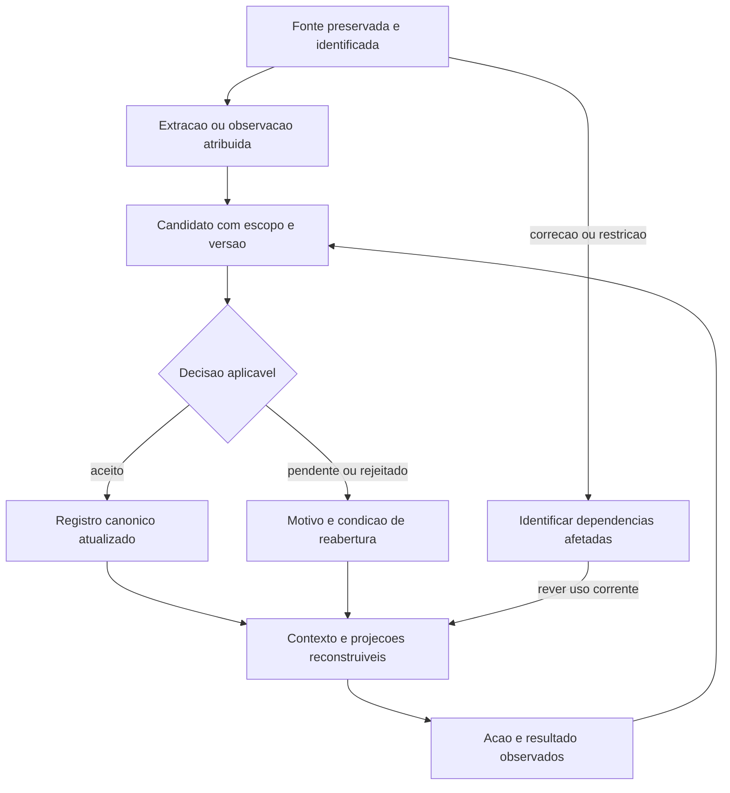

# Second-brain convergence: da memória recuperável à decisão confiável

**Revisão aprofundada:** 2026-09-05  
**Escopo:** espelhos locais em `OS/`, arquitetura e código do VISA-BRAIN e do MKT-LENDARIO.  
**Natureza:** pesquisa e propostas de engenharia. Não altera contratos, instala plataformas ou autoriza migrações.  
**Método:** releitura crítica do memo original e pesquisas relacionadas; inspeção de documentação primária, implementações e testes; duas reproduções sintéticas; conferência de literatura primária na web.  
**Limites:** nenhum benchmark de fornecedor foi reexecutado; nenhum caso privado de imigração foi aberto. A revisão é do autor desta versão, sem auditor independente. Estado local e hashes constam no §12.

## 1. O achado central

A convergência observada é real como **ampliação das superfícies de produto**: busca, consolidação, contexto sugerido, integração ao host e coordenação aparecem juntos com mais frequência nos projetos examinados. Isso não demonstra uma arquitetura vencedora nem uma tendência estatística de todo o mercado.

A hipótese mais útil para nossos projetos é outra: **o valor do segundo cérebro está em conservar as condições sob as quais uma informação pode orientar uma ação.** Recuperar uma frase é apenas uma etapa. É preciso preservar quem a disse, o que ela sustenta, quando vale, quem pode usá-la, o que a contradiz e o que muda quando ela é corrigida.

Para o **VISA-BRAIN**, a direção é memória de evidência com revisão e invalidação rastreáveis. Para o **MKT-LENDARIO**, é memória de decisões e resultados que reduz repetição de erros e retrabalho. Eles podem compartilhar contratos de proveniência, tempo e recuperação; precisam manter autoridades, dados e critérios de decisão próprios.

As descobertas que mais mudam a recomendação:

1. **O memo misturava eixos diferentes.** Recall e síntese são funções; hub e plugin são formas de integração. Um produto pode reunir tudo sem perder a fonte da verdade, desde que preserve tipos, autoridade e transições.
2. **Os scores não sustentam uma escolha de plataforma.** Até números chamados R@5 podem usar denominadores e regras diferentes. O mem0 citado mede a plataforma gerenciada, com otimizações ausentes no SDK aberto. [O3] · [O4] · [O5]
3. **Já existe avaliação além de recall.** Há testes do gbrain para precisão de push, falso disparo, isolamento e orçamento de contexto. O pack local não cobrir uma dimensão não significa que o projeto não a avalie. [O14]
4. **Nossos sistemas já possuem parte importante da resposta.** VISA tem registros tipados, revisão, fonte original e gates; MKT tem Truth/Evidence/Action/Projection e resolução seletiva de contexto. Recomendar um “brain” genérico ignoraria esse investimento. [V1] · [V2] · [M1] · [M2]
5. **Há problemas locais reproduzíveis mais prioritários que trocar o motor de busca.** O grafo do VISA perde o estado de uma alegação proposta. O validador do MKT confunde integridade de evento histórico com igualdade ao arquivo atual. [V3] · [M3]
6. **A próxima fronteira é a correção que se propaga.** Não basta aprender uma informação nova. É necessário retirar o uso indevido das versões e conclusões antigas, inclusive em briefings, drafts e caches.

## 2. O que esta revisão corrige

Classificação usada abaixo: **observado** significa arquivo ou código inspecionado; **reproduzido** significa comportamento executado nesta revisão; **reportado** significa resultado publicado pelo projeto; **inferência** é nossa interpretação; **proposta** ainda depende de implementação e validação.

| Formulação anterior ou complementar | Correção sustentada | Implicação |
|---|---|---|
| Cinco jobs: recall, dream, push, frota, plugin | Mistura função cognitiva, mecanismo de entrega e topologia operacional. | Comparar por eixos independentes antes de pontuar produtos. |
| Um store para vários jobs perde SoT | Uma base física pode ter tabelas, tipos e transições distintas. Vários bancos também podem divergir sobre o mesmo fato. | O critério é autoridade lógica e controle de escrita, não número de databases. |
| Mempalace recusa search quando o fingerprint do hub diverge | A função CLI inspecionada recusa o encaminhamento ao hub e permite seguir pelo caminho direto. Falha após o hub aceitar a busca recebe outro tratamento. | Compatibilidade de backend não é autorização de acesso, nem bloqueio universal de busca. [O2] |
| Dream do gbrain promove takes → facts, como descrito em `second-brain-protocols.md` | O documento primário e a fase `consolidate` descrevem **facts → takes**. O trecho implementado seleciona um texto do cluster, sem nova síntese por LLM, e vincula os contribuintes. | Atribuição e transformação não podem ser substituídas pela leitura literal de nomes como “fact”. [O7] · [O8] |
| Captura ambiente acompanha push default-on | Push é leitura; `memory.auto_writeback` é opt-in e parte de `off` no resolvedor inspecionado. | Autorizar contexto sugerido não autoriza persistência automática. [O9] |
| mem0: 94,4 LME / 92,5 LoCoMo caracteriza o SDK | O README atribui os resultados à plataforma gerenciada, em orçamento `top_200`, com otimizações proprietárias. | Não transferir o placar para uma instalação open source. [O5] |
| Memori é essencialmente log de ação | Seu README também descreve persistência e recuperação de conversas. Atribuição de ações é uma capacidade, não definição exclusiva. | Não reduzir um sistema ao job que interessou ao benchmark anterior. [O10] |
| Push/dream/continuidade estão apenas na lista de dimensões futuras | Há testes para comportamento de push e isolamento, além do placar de recuperação. | Inspecionar metodologia e execução antes de propor outro pack. [O14] |
| Um threshold de confiança equivale a probabilidade de acerto | O push do gbrain atribui valores por braço de resolução; o Dream skill do mem0 aproxima similaridade por sobreposição lexical. | São heurísticas operacionais, não probabilidades calibradas. [O11] · [O12] |
| Basta importar as lições de OS | Existem capacidades locais e pesquisa anterior que já absorveram várias delas. | Priorizar os deltas demonstrados, evitando uma segunda implementação. [M4] · [V1] |

A correção do sentido de `consolidate` acima vale para esta revisão. O memo complementar permanece um documento anterior e precisa dessa errata ao ser reutilizado. A repetição da mesma interpretação em dois memos não constitui confirmação independente.

## 3. Um mapa que permite comparar sem confundir

### 3.1 Seis perguntas independentes

| Eixo | Pergunta de projeto | Exemplos de escolhas |
|---|---|---|
| Objeto | O que estamos armazenando? | Documento original, declaração atribuída, fato vigente, hipótese, preferência, decisão, evento observado |
| Autoridade | Quem pode criar, aceitar, corrigir e retirar esse objeto? | Fonte externa, owner, reviewer, executor determinístico |
| Transformação | O que acontece entre entrada e uso? | Extração, classificação, síntese, reconciliação, promoção, invalidação |
| Recuperação | Quando e como a memória entra na tarefa? | Busca explícita, contexto inicial, delta, sugestão por entidade |
| Execução | Como o trabalho continua e produz efeito? | CLI, plugin, serviço, fila, checkpoint, recibo |
| Fronteira | Para quem, quando e para qual finalidade ela é válida? | Workspace, business, pessoa, período, destinatário, estágio, sensibilidade |

Separar esses eixos evita duas conclusões falsas: que um plugin torna a memória inteligente e que um grafo torna as afirmações verdadeiras.

### 3.2 Posicionamento dos projetos examinados

| Projeto | Contribuição mais relevante ao estudo | O que não se deve inferir |
|---|---|---|
| **mempalace** | Recuperação do bruto, relações temporais explícitas, compatibilidade entre cliente e hub | Verbatim prova que algo foi registrado, não que seu conteúdo é verdadeiro; hub não é governança empresarial |
| **gbrain** | Entidades, contexto sugerido, memória atribuída, consolidação e avaliação comportamental | `facts` não significa evidência verificada; presença em vários hosts não prova o mesmo comportamento de entrega |
| **mem0** | API de memória, extração e ferramentas de consolidação | Algoritmo do serviço, SDK e skill de Dream não são o mesmo componente nem compartilham automaticamente os mesmos resultados |
| **honcho** | Representações de pessoas e visões derivadas de conjuntos de sessões | Scope escolhido no pedido não substitui autorização; inferência sobre uma pessoa não é fato institucional |
| **Memori** | Persistência contextual com atribuição de entidade/processo e conversas | Resultado em QA não mede execução correta nem aprendizagem causal |
| **LifeOS** | Disciplina de contexto e roteamento de conhecimento | Uma instrução de skill, sozinha, não impede escrita direta fora do fluxo |
| **OpenClaw** | Host que monta contexto e integra mecanismos de memória | Compartilhar um host não torna os stores intercambiáveis nem resolve suas autoridades |
| **claude-mem** | Memória do trabalho entre sessões e integração ao ambiente | Histórico de trabalho não substitui corpus canônico de negócio |
| **Paperclip** | Coordenação de trabalho, responsabilidade e retomada | Controle de tarefas não decide o que conta como verdade |

Os quatro primeiros tiveram inspeção focal de mecanismos nesta revisão. Memori entrou por seu README; LifeOS, OpenClaw, claude-mem e Paperclip são contexto complementar dos memos relacionados, com snapshot registrado, sem auditoria funcional completa. [O1] · [O3] · [O5] · [O10] · [O13] · [R1] · [R2]

## 4. O que os números permitem concluir

| Resultado | Escopo realmente sustentado | Limitação decisiva |
|---|---|---|
| mempalace raw: **96,6% R@5** | Relato de recuperação em 500 perguntas; armazenamento verbatim | Não harmonizamos seu scorer e tratamento de abstention com o gbrain; não é QA final. [O3] · [O4] |
| gbrain hybrid: **93,19%, 438/470** | Todas as sessões gold nos cinco resultados; reranker desligado | Exclui 30 perguntas de abstention; uma execução reportada; não mede resposta final. [O1] |
| gbrain hybrid + rerank: **95,32%, 448/470** | Mesmo conjunto, com reranker | Ganho líquido esconde trocas: +18 acertos e −8 acertos frente ao híbrido. [O1] |
| gbrain hybrid + expansão: **54,89%, 258/470** | Mesma ablação com expansão de consultas | Evidência contra aquela expansão naquele orçamento; não contra toda expansão possível. [O1] |
| mem0: **94,4 LME / 92,5 LoCoMo** | Resultados divulgados da plataforma gerenciada | Componentes proprietários e `top_200`; não comparar diretamente a top-5 nem prometer esses números no SDK. [O5] |
| Memori: **87% LoCoMo / 721 tokens por consulta** | QA e footprint reportados no README | Não medimos configuração, custo integral de ingestão ou transferência para os nossos domínios. [O10] |

O salto do gbrain de aproximadamente 51% para 93% representa a recuperação de uma regressão intermediária. A série não sustenta a narrativa de que seu ponto de partida arquitetural era 51%. [O1]

O próprio LongMemEval separa extração, raciocínio entre sessões, tempo, atualização e abstenção, além dos estágios de indexação, recuperação e leitura. Excluir abstention de um cálculo de recall é compatível com aquele cálculo; excluí-la da avaliação de um produto seria uma lacuna central para nós. [LongMemEval, ICLR 2025](https://arxiv.org/abs/2410.10813)

LoCoMo foi construído para memória conversacional de longo prazo, com tarefas e dados próprios. Seu score não mede automaticamente acerto sobre evidência documental, autorização comercial ou manutenção de decisões. Essa última conclusão é uma inferência de transferência de domínio, não resultado do benchmark. [LoCoMo](https://arxiv.org/abs/2402.17753)

### 4.1 A omissão mais útil: BrainBench

O gbrain possui metodologia para falha de recuperação necessária, falso disparo, precisão/recall do push, fidelidade da escrita, proveniência, continuidade e violações de isolamento. Há código de teste e gate de baseline em CI. [O6] · [O14]

Três limites mudam a interpretação:

- O modo determinístico injeta uma extração gold. Ele testa preservação e atribuição no pipeline, não competência semântica do extrator.
- A linha Codex é declarada **contract**: a entrega de fragmentos é uma hipótese de integração, não uma prova do host em produção.
- A avaliação aponta diferenças entre adapters e produção; invariantes de isolamento não podem ser compensadas por uma média melhor.

Não reexecutamos essa suíte. Sua principal contribuição é metodológica: **avaliar a memória como comportamento ao longo de turnos**, com casos em que recuperar é obrigatório e casos em que o comportamento correto é permanecer em silêncio.

A conferência também encontrou diferença entre documento e teste: a metodologia descreve tokens injetados como diagnóstico sem gate; o arquivo de floors já impõe tetos ao baseline comprometido. Isso não prova um teto no runtime. Mostra por que é preciso distinguir prosa, teste de baseline e controle da execução. [O14]

O ranking do pack `memory-5way` continua sendo um artefato de sua rubrica. Esta revisão não recalcula scores nem endossa a estabilidade do ranking como critério de adoção.

## 5. Dez implicações que o memo inicial não desenvolveu

### 5.1 A unidade útil é a afirmação com condições de uso

“Temos uma fonte” é insuficiente. O sistema precisa distinguir pelo menos quatro coisas: o documento existe; alguém declarou algo nele; o trecho sustenta uma proposição delimitada; essa proposição pode ser usada nesta tarefa.

O gbrain ilustra o problema do vocabulário: `facts` inclui crenças e preferências do owner; `takes` pode incluir proposições verificáveis atribuídas a outros. Mudar de tabela não equivale a tornar uma proposição verdadeira. [O7]

**Implicação:** tipo epistemológico, aceitação e autorização são dimensões separadas. Uma decisão pode autorizar o uso de uma hipótese em um experimento sem validá-la como fato. Um fato bem sustentado pode continuar proibido para um destinatário. Um registro aceito pode depois ser substituído.

Isso favorece evoluir os campos existentes em CLM/EVD e Truth/Evidence/Action. Não justifica introduzir um “claim store universal” antes de demonstrar uma falha que os registros atuais não resolvem.

### 5.2 Consolidação é uma transformação com perdas

Ao resumir, o modelo escolhe o que remover. Modalizadores, tempo, sujeito e ressalvas são precisamente o que diferencia “cogitamos” de “aprovamos” e “a empresa alcançou” de “a pessoa realizou”.

**O teste de uma síntese deve perguntar se ela conserva as restrições da fonte**, além de perguntar se cobre seus tópicos. Uma síntese mais categórica ou específica que as entradas pode parecer melhor e ser epistemicamente pior.

O Dream skill do mem0 é instrutivo também pelo que não copiar: aproxima similaridade por palavras, preserva a maior confiança dos dois registros e descreve apagar os originais antes de adicionar o merge. Esse fluxo textual não demonstra transação nem justifica aumentar confiança. É distinto das APIs de preview e linhagem do serviço. [O12]

**Aplicação proposta:** gerar candidato com trecho, qualificadores e diff; preservar a origem; resolver conflito pelo responsável; somente depois ativar a versão resultante. Compressão não pode apagar o caminho de contestação.

### 5.3 Proveniência precisa sobreviver à repetição

Uma fala aparece na gravação, transcrição, resumo, briefing e documento final. São cinco artefatos e, possivelmente, uma única origem. Contar cinco fontes independentes cria falsa corroboração.

Também existe um loop autorreferente: o modelo escreve uma conclusão; um índice a recupera; outro modelo a cita; a repetição passa a parecer consenso. Diversidade de modelos não quebra o loop se todos descendem do mesmo material.

No VISA já há vocabulário de independência, `same-origin-only` e revisão do nexo entre fonte e claim. O contador `source_count`, porém, conta IDs de SRC. Esses conceitos precisam continuar distintos nas projeções. [V2] · [V5]

No MKT, uma peça publicada, um resumo de reunião e uma análise do próprio agente não devem corroborar a promessa que originalmente receberam do mesmo briefing. **A diversidade relevante é de origem e método de observação, não de arquivo ou modelo.**

### 5.4 Memória temporal exige mais de um relógio

Considere um exemplo sintético: uma decisão tomada em junho é importada em setembro; em agosto já houve uma decisão que a substituiu. Ordenar por data de importação recoloca junho no presente.

É necessário distinguir conceitualmente:

| Tempo | Pergunta |
|---|---|
| Ocorrência | Quando aconteceu ou foi dito? |
| Validade | A que período a proposição se aplica? |
| Registro | Quando o sistema tomou conhecimento? |
| Revisão | Quando e para qual uso ela foi verificada? |

Essas distinções podem caber em metadados existentes; não exigem um novo banco bitemporal. Um arquivo imutável pode carregar informação historicamente válida e operacionalmente vencida.

A reprodução do MKT expõe outra face do mesmo problema: um evento válido de v0→v1 não deve se tornar falso porque o presente avançou para v2. **Integridade histórica é compatibilidade com sua transição; atualidade é compatibilidade com o estado vigente.** [M3] · [M5]

### 5.5 Esquecer é retirar influência, não apenas apagar uma linha

Correção de conteúdo, expiração, revogação de uso e eliminação física têm efeitos diferentes. Retirar autorização não torna o evento histórico inexistente. Corrigir uma transcrição não autoriza apagar silenciosamente o que já foi decidido com base nela.

O problema operacional é a dependência: fonte → extração → síntese → decisão → draft → projeção. Se o elo inicial muda, quais resultados continuam utilizáveis? Um hash identifica diferença; sozinho não responde à pergunta.

**Proposta mínima:** localizar derivados por referências existentes, marcar os afetados para revisão e impedir seu uso vigente quando necessário. Recompilar projeções a partir do canônico. Uma dependência sem granularidade suficiente deve sinalizar incerteza, sem afirmar que todos os descendentes foram encontrados.

Isso vale também para cache e contexto já montado: um documento bloqueado no registro pode continuar influenciando uma sessão longa. A próxima ação material precisa revalidar as dependências relevantes.

Há uma lição concreta no código de consolidação do gbrain: a busca por um take previamente criado inclui registros inativos, para evitar recriar uma afirmação que o usuário retirou. A reutilização também respeita o registro resolvido. **Reprocessamento não pode ressuscitar conhecimento retirado.** Esse comportamento merece fixture própria nos dois projetos, além de deduplicação comum. [O8]

### 5.6 Isolamento é identidade + permissão + finalidade + derivação

O honcho documenta claramente que um pedido sem scope continua vendo o conjunto acessível sem aquele filtro. Scope restringe a visão solicitada; chaves e controles de acesso governam quem pode solicitar. [O13]

Nos nossos projetos, uma chave de memória baseada apenas em “Alan” seria insuficiente. A mesma pessoa pode aparecer como interlocutor, autor, responsável por negócio ou participante de um caso. Conhecimento de um papel não se transfere automaticamente aos demais.

**Aplicação:** resolver workspace/business antes da recuperação e manter o escopo nos resultados e derivados. O controle precisa alcançar busca lexical, vetores, snippets, caches, logs e exportação. Um filtro após o ranking pode vazar metadados e desperdiçar as primeiras posições com documentos que o usuário não pode usar.

Não é necessário proibir todo compartilhamento. Compartilhar exige vínculo explícito de escopo e finalidade. Nesta pesquisa, a transferência entre VISA e MKT é de contratos de engenharia, nunca de dados pessoais do caso.

### 5.7 Push deve otimizar a decisão, não a quantidade de contexto

O gbrain oferece um mecanismo útil: poucos ponteiros, supressão de repetição e silêncio em caso de ambiguidade. Suas estatísticas de uso são aproximadas; abrir uma página não demonstra que ela ajudou. [O11]

Um seletor orientado à tarefa deveria distinguir três classes: informação obrigatória para decidir; evidência complementar; conteúdo apenas semelhante. A similaridade, sozinha, pode privilegiar dez peças antigas e esconder a decisão recente que as invalida.

**Proposta de prioridade:** primeiro bloqueios, correções e mudanças relevantes; depois o mínimo de material necessário; por último sugestões opcionais dentro do orçamento. “Até três referências” é um teto inicial a experimentar, não um número universal.

Contexto longo não garante uso adequado da informação. O estudo Lost in the Middle mostrou sensibilidade à posição em modelos e tarefas de sua época. Ele motiva testar ordem e ruído; não prova que todos os modelos de 2026 apresentam a mesma curva. [Lost in the Middle](https://arxiv.org/abs/2307.03172)

### 5.8 A memória mais valiosa pode ser a razão de não fazer

Um sistema que só retém sucessos esquece os limites que os tornaram possíveis. Uma sugestão recusada retorna porque o resumo preservou a alternativa, mas descartou a razão da recusa.

**Memória de decisão útil:** escolha, alternativa relevante, motivo, escopo, pressupostos e condição de reabertura. A condição importa: uma recusa de hoje não deve virar proibição eterna quando o contexto muda.

VISA já exige preservar conflitos e decisões. MKT já possui eventos com supersessão e uma política de sinal do usuário. A oportunidade é fazer essas razões aparecerem antes da próxima sugestão equivalente, sem multiplicar arquivos de “lições aprendidas”. [V1] · [M1]

Medida proposta: reincidência de erro já corrigido em tarefa elegível. Uma queda nessa taxa é mais próxima do valor da memória que o crescimento do número de notas.

### 5.9 Aprendizagem exige resultado e limites de generalização

“Publicamos”, “a métrica subiu” e “a abordagem causou a melhora” são três proposições diferentes. Uma campanha pode melhorar por audiência, oferta, canal, sazonalidade ou seleção do público. Registrar o resultado é necessário; transformá-lo em regra universal requer evidência adicional.

Para MKT, a unidade reutilizável deve ser um aprendizado condicional: em qual contexto, qual intervenção, com qual comparação, que resultado, quais explicações alternativas e que próxima decisão ele informa. Não é preciso transformar todo trabalho em experimento controlado; onde não houver identificação causal, registrar a incerteza.

Para VISA, a mesma disciplina impede que uma escolha de organização ou um feedback pontual se transforme em conclusão sobre elegibilidade ou probabilidade de aprovação. O aprendizado reutilizável é de processo: por exemplo, preservar qualidade de fonte e evitar atribuição errada. [V1] · [V2]

**Teste decisivo:** uma tarefa posterior usa o aprendizado corretamente, inclusive recusando aplicá-lo fora do contexto. O sistema que só produz resumos ainda não demonstrou aprendizagem operacional.

### 5.10 Portabilidade real inclui retomar sem trocar de verdade

Instalar a mesma skill em dois hosts é portabilidade de embalagem. Continuidade exige resolver os mesmos registros, respeitar as mesmas permissões e reconhecer ações já executadas.

Um checkpoint útil referencia a tarefa, o workspace, a versão dos insumos, a decisão vigente e o próximo passo. O novo host deve reconstruir o contexto a partir dessas referências, revalidando o que envelheceu. Copiar um resumo de sessão não basta.

A nossa avaliação deve distinguir implementação de entrega e simulação de contrato: funcionar em uma CLI não prova comportamento equivalente em outro host.

A consequência de produto é preservar uma interface estreita sobre registros existentes. Um runtime externo só se justifica quando uma necessidade concreta de busca, escala ou coordenação exceder esse caminho.

## 6. Como isso melhora o VISA-BRAIN

### 6.1 O ponto de partida é forte, mas precisa ser descrito com precisão

A cadeia `INP/SRC → CLM → EVD → análise do pacote` já separa ingestão, proposição e preparação. Existem ciclo de vida, conflitos, locators, revisão de evidência, controles de divulgação e atualidade de dados oficiais. São mecanismos e instruções com níveis diferentes de enforcement, não uma garantia única de “tudo validado”. [V1] · [V2]

Também existe uma capacidade particularmente transferível ao MKT: `local_catalog.verify_completion` exige vinculação ao workspace, reconciliação dos objetos enumerados, recibos aplicáveis e nova varredura sem mudanças. O próprio resultado limita sua conclusão a cobertura da enumeração/revisão, sem afirmar acerto semântico. **Um resultado de busca não é prova de cobertura.** [V6]

### 6.2 Achado reproduzido: o grafo pode aumentar a certeza aparente

Foi executado `export_claim_graph.py` contra dois elementos inteiramente sintéticos: uma linha CLM com `record_lifecycle=proposed` e uma referência SRC. O exportador terminou com código 0 e produziu:



O grafo não exibiu `proposed`. O código usa a presença do SRC na coluna `Sources` para escrever `supports`; não consulta a avaliação semântica de `claim_evidence_relations` para escolher essa aresta. A função de lifecycle considera `proposed` ativo, coerentemente com uma visão de trabalho pendente. O problema é a perda dessa distinção na apresentação. [V3] · [V4]

**Alcance comprovado:** ambiguidade da projeção. Não foi demonstrado bypass de aceitação, de revisão, de exportação de pacote ou de filing.

**Melhoria delimitada proposta:** exibir lifecycle e usar relação neutra, como “referencia”, quando o exportador conhece apenas o vínculo. Onde houver relação revisada, projetar sua qualificação real. Continuar mostrando pendências sem apresentá-las visualmente como conclusões aceitas.

**Prova de conclusão futura:** exemplos sintéticos com proposta, aceitação, fonte contradita, supersessão e referência ausente produzem rótulos coerentes; nenhuma mudança automática de estado canônico.

### 6.3 Independência deve permanecer visível, sem virar nota jurídica

`claim_evidence_relations.py` já distingue independência, origem, completude, atualidade, corroboração e nexo. `source_count` no validador compara quantidade de SRCs. Por isso, recomendar “adicionar avaliação de independência” seria repetir algo existente. [V5]

O delta é **usar essas qualificações na visão de risco e na revisão**, sem tratar duas referências como duas origens independentes. Há também uma distinção de interface: o helper pode retornar `status: ready` quando o bloco é estruturalmente válido, mesmo com observações como `stale` ou `contradicted`. O próprio código declara o caráter consultivo dos atributos. Esse `ready` não pode ganhar o significado de prontidão para uso em outro consumidor.

Começar pela projeção dos campos existentes. Uma nova entidade de “família de origem” só deve ser criada se casos representativos mostrarem que os vínculos atuais não preservam a dependência.

### 6.4 Correções precisam invalidar o uso dependente

O VISA já tem precedentes de verificação por hash: o gate de draft exige correspondência com o texto auditado; a auditoria registra um snapshot canônico. [V7]

**Proposta:** testar a propagação de uma correção ao longo da cadeia existente. Se muda a fonte ou a proposição, quais EVDs, drafts e projeções precisam de nova revisão? Estender os mecanismos de dependência demonstradamente necessários, sem abrir um registro paralelo de fatos.

O experimento deve começar com uma fonte sintética, uma claim, um EVD e um draft. Corrigir a origem, reabrir a tarefa em contexto fresco e verificar se o resultado anterior deixa de ser apresentado como corrente. Esta revisão não prova que hoje falta toda essa proteção; identifica o comportamento ponta a ponta que ainda precisa ser demonstrado.

### 6.5 Continuidade orientada ao estágio e às lacunas

O boot já inclui presença, perfil de conversa, notas e retomada; o DAG possui digest por modo. O ganho seguinte é tornar a retomada pequena e operacional: etapa selecionada, pendência relevante, conflito aberto, alteração desde a última sessão e referência para abrir a evidência. [V1]

As informações oficiais mutáveis continuam sob o contrato de atualidade do workspace. A camada de memória pode sugerir “rever esta fonte”, mas não resolver o dado vigente por recordação.

**Resultado esperado a testar:** menos perguntas repetidas e menos retomadas com estado antigo, preservando a separação entre personalização da conversa e prova factual.

### 6.6 Ordem de prioridade para VISA

| Ordem | Entrega proposta | Reuso | Critério de aceitação |
|---|---|---|---|
| V1 | Corrigir semântica e estado do grafo | Exportador e lifecycle atuais | Proposta não aparece como apoio aceito; qualificação preservada |
| V2 | Projetar origem/independência e observações | Relações no EVD e auditoria existentes | Quantidade de arquivos não mascara mesma origem ou contradição |
| V3 | Demonstrar invalidação após correção | Hashes, revisões, registros e projetores | Resultado dependente fica pendente de revisão quando aplicável |
| V4 | Retomada compacta com mudança e bloqueio | Companion, notas e DAG digest | Nova sessão recupera o estado certo sem duplicar canônicos |

Código de produto permanece em `VISA-BRAIN/`. Testes e fixtures ficam em `dev/visa-brain/`; pesquisa em `docs/`; qualquer estado real fica exclusivamente no workspace privado. Atualizações futuras precisam respeitar o pin de cada consumidor e sua validação. Nenhum desses passos foi implementado nesta revisão.

## 7. Como isso melhora o MKT-LENDARIO

### 7.1 Construir sobre o Business Brain já existente

O contrato distingue Truth, Evidence, Action e Projection; o resolvedor possui planos de contexto, hashes, razões de carga, limites e tratamento de escopo. O recorte do ETL já descreve uma fonte, candidato, decisão, atualização do arquivo e briefing. [M1] · [M2] · [M6]

A pesquisa de 05/09 sobre OS aplicado ao MKT já recomendou esse caminho e documentou a falha temporal. Esta revisão o aprofunda, sem apresentar o fluxo como descoberta inédita. [M4]

### 7.2 Achado confirmado: evento histórico não é snapshot do presente

A reprodução existente foi executada novamente nesta revisão contra a função real `validateWriteback`:

```text
Evento histórico: v0 → v1
Arquivo atual = v1: nenhuma falha
Arquivo atual = v2: truth_transition.after_hash diverge do artefato
```

A função compara `after_hash` de cada evento ao conteúdo atual do arquivo. Assim, o histórico não consegue permanecer válido após uma segunda atualização legítima. O teste usou arquivo temporário e não alterou Truth real. [M3] · [M5]

**Correção proposta:** validar eventos históricos contra sua cadeia de versões; validar a cabeça aplicável contra o presente; validar o `before_hash` do candidato no momento do apply. Definir como edições manuais entram nessa reconciliação. Não “corrigir” o problema reescrevendo os hashes antigos.

Isso precisa preceder a automação de promoção. Caso contrário, o sistema cria uma escolha ruim entre invalidar o histórico e falsificá-lo para satisfazer o presente.

### 7.3 Achado documental: a própria governança está sujeita a memória vencida

O `AGENTS.md` ainda descreve D1/interface pública como pendente e L0–L4 como retido. O contrato de Business Brain e o estado machine-readable registram composição domain-first ratificada e remoção do legado executada, enquanto o cutover das capabilities permanece bloqueado. São marcos diferentes. [M1] · [M7] · [M8]

**Observação, não autorização:** a divergência textual foi verificada; esta pesquisa não resolve a precedência operacional nem libera migração. A correção deve reconciliar o entrypoint com o registro de decisão e os gates aplicáveis.

A lição vai além de documentação: instruções iniciais desatualizadas podem direcionar corretamente uma busca para a arquitetura errada. **Atualidade de governança precisa vir antes da expansão da memória.** Um check de correspondência entre marcos específicos é mais útil que simplesmente carimbar todas as páginas como “atualizadas”.

### 7.4 O primeiro produto é um briefing que muda a próxima ação

O briefing deve responder: o que mudou; o que bloqueia; qual decisão é necessária; qual fonte a sustenta; qual próximo passo está permitido. Não precisa recontar o corpus nem sintetizar a empresa inteira.

**Extensão proposta ao caminho existente:** preparar referências versionadas para oferta aplicável, decisão relevante e evidência autorizada. Mostrar a permissão efetiva de uso, inclusive diferença entre draft e final, sem resumir tudo a `ready`.

Para contexto seletivo, separar três medições: o resolvedor planejou um arquivo; o host leu seu conteúdo; o conteúdo influenciou adequadamente a decisão. O código atual conta palavras e hashes do plano; isso não demonstra consumo integral de tokens nem utilização real pelo modelo. [M2]

A prova não é “o briefing foi gerado”. É uma tarefa de produção subsequente usar a mudança correta e evitar uma versão ultrapassada.

### 7.5 Fechar aprendizagem sem congelar toda hipótese

O fluxo de promoção deve aproveitar `candidate`, `decision`, `truth_transition` e recibos já previstos, começando por um arquivo alvo. [M3] · [M6]

O ganho adicional é preservar o retorno da execução: o que foi feito, o resultado observado, o contexto e o limite da conclusão. Uma hipótese promissora pode permanecer utilizável em exploração sem virar Truth comercial. Uma peça final precisa respeitar fatos e autorizações vigentes.

**Piloto proposto:** selecionar uma correção de processo ou decisão comercial já autorizada, aplicar pelo fluxo canônico e observar uma tarefa posterior. Verificar se a correção é recuperada, se o motivo da decisão sobrevive e se a mesma sugestão inadequada deixa de voltar.

O experimento deve medir também o esforço humano. Transferir dezenas de propostas triviais ao founder pode aumentar burocracia e diminuir a qualidade de aprovação. Agrupar ruído e priorizar decisões materiais é parte do produto, preservando quem tem autoridade sobre cada artefato.

### 7.6 Ordem de prioridade para MKT

| Ordem | Entrega proposta | Reuso | Critério de aceitação |
|---|---|---|---|
| M1 | Reconciliar marcos de governança nos entrypoints | Estado de migração, ADR e contrato | D1 e cutover de capability deixam de ser confundidos |
| M2 | Corrigir validação temporal | `check-business-brain.mjs` e testes atuais | v0→v1→v2 preserva histórico; candidato antigo não sobrescreve v2 |
| M3 | Briefing pequeno por negócio | Resolvedor, fontes, gates e eventos | Estado e permissão de uso corretos; referências verificáveis |
| M4 | Uma promoção com diff e retomada | Schema de eventos e artefato existente | Interrupção não duplica efeito nem produz falsa conclusão |
| M5 | Uso posterior do aprendizado | Decisão e evento de resultado | Próxima tarefa aplica a correção dentro do escopo |

Não criar um claim store transversal, novo portal ou serviço vetorial como condição do piloto. O recorte do ETL já pede três usos reais antes de ampliar. Preservar esse limite e acrescentar evidência de uso posterior, em vez de aumentar a lista de componentes. [M6]

## 8. O que um projeto pode ensinar ao outro

| Contrato transferível | VISA → MKT | MKT → VISA | Limite da transferência |
|---|---|---|---|
| Proposição e evidência separadas | Distinguir promessa de marketing, fonte e autorização de uso | Separar materiais de produção do registro factual | Taxonomia jurídica não vira taxonomia de marketing |
| Cobertura com denominador | Uma pesquisa “completa” declara universo, pendências e recibos | Consulta e navegação seletivas evitam ler tudo em tarefa local | Não exigir auditoria integral para cada peça simples |
| Contexto por finalidade | Atualidade e autorização antes da ação | Plano pequeno com motivo de carga e hash | Um plano não substitui controle de acesso do host |
| Correção e versões | Fonte alterada reabre dependências | Cadeia de decisão permite preservar razão e resultado | Nunca sincronizar dados dos dois domínios por identidade pessoal |
| Projeção reconstruível | Dashboard não vira novo registro | Briefing não vira nova Truth | Ambos devem preservar estados e qualificadores |
| Melhoria de processo | Feedback pode gerar prevenção e fixture sintética | Aprendizado precisa melhorar uma tarefa posterior | Resultado de negócio ou caso isolado não prova regra universal |

O denominador comum é uma **gramática de evidência e decisão**, não um cérebro global do usuário. Reutilizar conceitos, funções portáveis quando justificadas e testes sintéticos. Manter owners, permissões, corpora e destinos separados.

## 9. O menor desenho capaz de testar a tese



O desenho representa responsabilidades, não sete serviços novos. Os arquivos e executores existentes devem realizar o primeiro ciclo.

Para um apply futuro, a unidade mínima deve vincular alvo, versão anterior, conteúdo proposto e decisão. O executor compara o estado antes de gravar; registra intenção suficiente para retomada; reconhece efeito já aplicado; finaliza o recibo e reconstrói projeções. Um rename isolado não torna arquivo, ledger e índice uma transação única.

A direção de falha depende do efeito. Falha de uma sugestão opcional de memória pode permitir continuar a conversa. Falta de evidência ou autorização necessária deve impedir a ação dependente. “Fail-open” e “fail-closed” só têm significado quando se declara **qual operação** continua ou para.

## 10. Como medir melhora de verdade

### 10.1 Bateria inicial proposta, ainda não executada

Preparar **24 cenários por projeto**, três por classe abaixo. É uma bateria diagnóstica inicial, não amostra com poder para declarar superioridade universal. Usar fixtures sintéticas na engenharia; avaliação com dados privados permanece no workspace autorizado.

| Classe | Exemplo sintético | Comportamento esperado |
|---|---|---|
| Recuperação necessária e silêncio | A decisão mudou; outra tarefa é inteiramente nova | Recupera a mudança no primeiro caso; evita contexto irrelevante no segundo |
| Tempo e supersessão | Registro antigo importado depois do novo | Mantém ordem de validade, explica a versão histórica quando perguntado |
| Proveniência e independência | Original, resumo e repost da mesma fala | Não conta três origens independentes |
| Escopo e uso | Mesmo nome em dois workspaces; fonte com uso restrito | Não cruza fronteira nem oferece uso proibido |
| Correção e derivados | Fonte corrigida depois de gerar um draft | Revisa dependências; não reapresenta o resultado anterior como vigente |
| Incerteza e ausência | Evidência insuficiente ou contraditória | Declara lacuna, preserva conflito e evita completar por imaginação |
| Retomada e concorrência | Interrupção após escrita; candidato com hash antigo | Reconhece efeito existente; recusa sobrescrita indevida |
| Aprendizado e limites | Correção anterior reaparece em contexto parecido e diferente | Usa no contexto válido; não generaliza automaticamente |

Cada cenário precisa declarar fontes permitidas e proibidas, instante de referência, decisão esperada, comportamento de abstenção e erro eliminatório. Incluir pares com nomes iguais e origens diferentes; corpus fácil demais pode fazer um filtro ruim parecer seguro.

### 10.2 Métricas separadas

| Medida | Definição operacional proposta |
|---|---|
| Recuperação necessária | Tarefas elegíveis em que a evidência necessária ficou disponível ao decisor / tarefas elegíveis |
| Falso disparo | Tarefas que deveriam permanecer sem sugestão, mas receberam contexto / tarefas de silêncio |
| Resposta sustentada | Proposições materiais corretas e apoiadas pelo trecho citado / proposições materiais avaliadas |
| Atualidade | Decisões que usaram a versão válida na data de referência / decisões avaliadas |
| Violação de fronteira | Número de recuperações, derivados ou ações que usaram escopo proibido |
| Propagação da correção | Derivados afetados corretamente sinalizados / derivados afetados conhecidos na fixture; medir também falsos bloqueios |
| Reincidência | Tarefas elegíveis em que um erro previamente corrigido voltou / tarefas elegíveis posteriores |
| Continuidade | Retomadas que preservaram decisão, permissões e próximo passo / retomadas avaliadas |
| Custo total | Ingestão, revisão, reconstrução, recuperação, leitura e intervenção humana por tarefa aceita |
| Uso posterior | Aprendizados aplicados corretamente em nova decisão / oportunidades posteriores revisadas |

Não agregar violação de isolamento ou promoção indevida em uma média compensável. Para a bateria de aceitação, exigir zero nessas classes e relatar tamanho e limites da amostra. Zero observado não prova risco zero fora da bateria.

### 10.3 Desenho de comparação

1. Congelar corpus, permissões, perguntas, datas, modelo leitor, orçamento e resultado esperado.
2. Medir o caminho atual com busca estruturada/lexical e registros existentes.
3. Comparar uma mudança por vez: contexto seletivo, aliases/segmentação, híbrido, reranker ou expansão.
4. Comparar também ao contexto completo permitido quando ele couber; armazenamento especializado precisa justificar o custo adicional.
5. Medir decisão final, ruído, fontes abertas, tokens efetivos quando disponíveis e tempo humano. Palavras estimadas não são tokens faturados.
6. Repetir etapas estocásticas; inspecionar casos que melhoraram **e** os que regrediram. Reservar casos para avaliação posterior às escolhas de implementação.
7. Fazer revisão cega por avaliador independente antes de alegar vantagem de qualidade. Esta revisão do relatório não realizou essa etapa.

Uma ablação com memória desligada pode estimar contribuição no teste, desde que o leitor e o restante do fluxo permaneçam comparáveis. Melhor desempenho em fixtures ainda precisa sobreviver a três ciclos reais e a uma nova tarefa após retomada.

## 11. Decisão de adoção e sequência recomendada

| Opção | Quando passa a merecer piloto | O que provar antes de adotar |
|---|---|---|
| Caminho atual com melhores projeções | Já existem registros, autoridade e busca útil | Correção de estado, tempo, dependências e uso posterior |
| gbrain | Falhas recorrentes de contexto institucional excedem o caminho atual | Ganho no corpus local, isolamento, custo de manutenção e fronteira de writeback |
| mempalace | Recuperação fiel do bruto é o gargalo demonstrado | Localização correta, versão/locator preservados e política de retenção compatível |
| mem0 | Um aplicativo precisa de API de memória por usuário/sessão | Qual componente será usado, custo real e qualidade dessa configuração específica |
| honcho | Memória de relacionamento por pessoa e sessão é a necessidade autorizada | Escopos e derivados isolados, consentimento aplicável e limites da inferência |
| Paperclip | Coordenação, propriedade e retomada do trabalho são o gargalo | Redução de falhas de execução sem assumir autoridade sobre o corpus |

**Sequência recomendada:** corrigir primeiro as duas superfícies concretas encontradas e reconciliar a governança do MKT; entregar uma projeção útil por projeto; demonstrar um ciclo de correção e uso posterior; só então comparar novos mecanismos de recuperação.

As recomendações mudam se uma medição revelar que o principal erro é não encontrar a fonte, apesar de estados e permissões corretos. Nesse caso, busca e segmentação sobem de prioridade. Se o erro estiver na interpretação do trecho, melhorar recall sozinho terá retorno limitado. Se os registros estiverem corretos mas ninguém usar o resultado, o gargalo será integração à tarefa e carga de revisão humana.

**Pergunta de produto que deve orientar o investimento:** qual decisão futura fica mais correta, mais rápida ou menos repetitiva por causa desta memória, e como conseguimos demonstrar isso sem perder a capacidade de corrigir o sistema?

## 12. Evidência, rastreabilidade e limites

### 12.1 O que foi efetivamente verificado nesta revisão

- Leitura completa do memo original e inspeção dos protocolos complementares pertinentes.
- Inspeção de documentos primários e trechos de implementação citados; leitura integral dos helpers VISA de grafo, lifecycle e relações de evidência.
- Confirmação no documento e código de que `consolidate` faz facts → takes.
- Confirmação dos limites de benchmark, writeback opt-in, fallback do hub e scopes.
- Execução da reprodução temporal existente do MKT: **reproduced: true**, sem mutação de workspace real.
- Execução sintética do exportador VISA: saída com `supports`, sem rótulo `proposed`.
- Conferência na web dos artigos LongMemEval, LoCoMo e Lost in the Middle e de páginas dos repositórios em commits fixados.

Não foram executadas as suítes completas de produto, benchmarks de fornecedores, testes com casos privados ou o piloto de 24 cenários. As propostas não constituem uma auditoria de segurança integral nem prova de melhoria operacional já obtida. Os achados de produto continuam abertos e delimitados nos §§6–7.

### 12.2 Snapshots dos espelhos

Todos os nove espelhos abaixo estavam sem alterações locais no momento da checagem. Esses são commits examinados, não alegação de versão mais recente disponível.

| Espelho | Commit |
|---|---|
| gbrain | `8c70f6255047a7647adb30b1d6333a48068d9fa5` |
| mempalace | `d5250c788995cbdc17a6c095345a98a997ad1728` |
| mem0 | `dae67f74f5cc7bf138c7d7d6f9cec5ce4b4373b3` |
| Memori | `10d65015007131a69b2597fa5130da58da24a0c2` |
| honcho | `be54355545b64ddb10203829d323861f52423685` |
| OpenClaw | `8637d26b73b3a8af65ecebd309d401c979a16813` |
| LifeOS | `5e2f2e8c0abde612da0e99c16c0d07d4ec21b88c` |
| claude-mem | `b6e05382e2be35e29f22335f04a6890a4c0ba976` |
| Paperclip | `3ed5b7c5c8574c88b45c2a189cf27e22030469d7` |

Foram observadas alterações concorrentes em OS, MKT e documentação de engenharia do monorepo VISA. Foram preservadas. Esta revisão editou somente este relatório. A fotografia dos consumidores é do working tree, sem alegação de snapshot transacional entre repositórios.

### 12.3 Recibos das duas reproduções

**VISA:** Python, `TemporaryDirectory`, matriz mínima com CLM proposta; execução do exportador real; saída Mermaid verificada; diretório temporário descartado. Hash do exportador:

```text
f939cbb06c9c7973e05960db88049c4f45e2d43e1e94eff5c58c6e7b2c2cb03b
```

O cenário é repetível fornecendo ao exportador uma matriz com cabeçalhos `ID`, `Limited claim`, `Sources`, `record_lifecycle` e a linha `CLM-001 | Synthetic pending claim | SRC-001 | proposed`. Nenhum EVD revisado é necessário para a aresta observada. O teste demonstra a projeção, não a validade de um workspace completo.

**MKT:** comando de reprodução já existente:

```sh
node /Users/oalanicolas/Code/MKT-LENDARIO/docs/research/2026-09-05-os-company-brain/reproduce-temporal-check.mjs
```

Hash de `check-business-brain.mjs` usado:

```text
a0e97ef645024058ae6fb6efac07379c1db548d79d129ce43910eede67d4b8b2
```

O diagnóstico extrai a função real para execução isolada com fixture temporária. Não equivale a teste ponta a ponta de promoção. Resultado: `before: []`; após avançar para v2, falha de `after_hash`; `real_workspace_mutated: false`.

Hash do memo original antes desta revisão:

```text
8571ee0461fa32138bd19c05eda0f6a491bfca4236244851bc92a3964f4aaef0
```

### 12.4 Fontes locais e relação com pesquisas anteriores

Os links de arquivo são da instalação examinada. Os commits acima permitem reencontrar as fontes dos espelhos; números de linha são localizadores desta fotografia.

| Referência | Fonte e papel |
|---|---|
| O1 | [gbrain: avaliação pública e ablações](/Users/oalanicolas/Code/OS/gbrain/docs/eval-bench.md:361) |
| O2 | [mempalace: encaminhamento CLI ao hub](/Users/oalanicolas/Code/OS/mempalace/mempalace/cli.py:721) |
| O3 | [mempalace: README de benchmarks](/Users/oalanicolas/Code/OS/mempalace/README.md:229) |
| O4 | [mempalace: metodologia e limitações históricas](/Users/oalanicolas/Code/OS/mempalace/benchmarks/BENCHMARKS.md:42) |
| O5 | [mem0: resultados e escopo da plataforma](/Users/oalanicolas/Code/OS/mem0/README.md:45); [página no commit](https://github.com/mem0ai/mem0/blob/dae67f74f5cc7bf138c7d7d6f9cec5ce4b4373b3/README.md) |
| O6 | [gbrain: BrainBench](/Users/oalanicolas/Code/OS/gbrain/docs/eval/BRAINBENCH.md); [página no commit](https://github.com/garrytan/gbrain/blob/8c70f6255047a7647adb30b1d6333a48068d9fa5/docs/eval/BRAINBENCH.md) |
| O7 | [gbrain: takes e facts](/Users/oalanicolas/Code/OS/gbrain/docs/takes-vs-facts.md) |
| O8 | [gbrain: fase consolidate](/Users/oalanicolas/Code/OS/gbrain/src/core/cycle/phases/consolidate.ts) |
| O9 | [gbrain: resolvedor de writeback](/Users/oalanicolas/Code/OS/gbrain/src/core/facts/writeback-config.ts) |
| O10 | [Memori: conversas, atribuição e benchmark](/Users/oalanicolas/Code/OS/memori-labs/README.md) |
| O11 | [gbrain: push, thresholds e limites de telemetria](/Users/oalanicolas/Code/OS/gbrain/docs/guides/push-context.md) |
| O12 | [mem0: Dream skill, heurísticas e sequência de merge](/Users/oalanicolas/Code/OS/mem0/integrations/mem0-plugin/skills/dream/SKILL.md) |
| O13 | [honcho: scopes e fronteira de autorização](/Users/oalanicolas/Code/OS/honcho/docs/v3/documentation/features/advanced/scopes.mdx) |
| O14 | [gbrain: floors executáveis](/Users/oalanicolas/Code/OS/gbrain/test/brainbench-floors.test.ts); [gate de baseline](/Users/oalanicolas/Code/OS/gbrain/scripts/ci-brainbench-gate.sh) |
| V1 | [VISA-BRAIN: contrato de operação e separação](/Users/oalanicolas/Code/usa-process/VISA-BRAIN/AGENTS.md) |
| V2 | [VISA-BRAIN: revisão de evidência e independência](/Users/oalanicolas/Code/usa-process/VISA-BRAIN/.codex/skills/review-immigration-evidence/references/review-contract.md) |
| V3 | [VISA-BRAIN: exportador de grafo](/Users/oalanicolas/Code/usa-process/VISA-BRAIN/.codex/skills/visa-brain/scripts/export_claim_graph.py:44) |
| V4 | [VISA-BRAIN: lifecycle ativo](/Users/oalanicolas/Code/usa-process/VISA-BRAIN/.codex/skills/visa-brain/scripts/record_lifecycle.py:16) |
| V5 | [VISA-BRAIN: relações qualificadas](/Users/oalanicolas/Code/usa-process/VISA-BRAIN/.codex/skills/visa-brain/scripts/claim_evidence_relations.py); [validação de source_count](/Users/oalanicolas/Code/usa-process/VISA-BRAIN/.codex/skills/visa-brain/scripts/validate_visa_brain.py:2047) |
| V6 | [VISA-BRAIN: cobertura de fontes enumeradas](/Users/oalanicolas/Code/usa-process/VISA-BRAIN/.codex/skills/visa-brain/scripts/local_catalog.py:838) |
| V7 | [VISA-BRAIN: gate de draft audit](/Users/oalanicolas/Code/usa-process/VISA-BRAIN/.codex/skills/visa-brain/scripts/draft_audit_release_gate.py:24); [snapshot na auditoria](/Users/oalanicolas/Code/usa-process/VISA-BRAIN/.codex/skills/visa-brain/scripts/audit_draft_against_canonical.py:181) |
| M1 | [MKT: contrato Business Brain](/Users/oalanicolas/Code/MKT-LENDARIO/docs/architecture/business-brain-contract.md) |
| M2 | [MKT: resolvedor de contexto](/Users/oalanicolas/Code/MKT-LENDARIO/scripts/resolve-context-plan.mjs) |
| M3 | [MKT: validação de writeback](/Users/oalanicolas/Code/MKT-LENDARIO/scripts/check-business-brain.mjs:62) |
| M4 | [MKT: pesquisa prévia de OS aplicada ao negócio](/Users/oalanicolas/Code/MKT-LENDARIO/docs/research/2026-09-05-os-company-brain/README.md) |
| M5 | [MKT: reprodução temporal existente](/Users/oalanicolas/Code/MKT-LENDARIO/docs/research/2026-09-05-os-company-brain/reproduce-temporal-check.mjs) |
| M6 | [MKT: recorte operacional do ETL](/Users/oalanicolas/Code/MKT-LENDARIO/docs/architecture/etl-cognitivo-dag.md) |
| M7 | [MKT: entrypoint do agente](/Users/oalanicolas/Code/MKT-LENDARIO/AGENTS.md) |
| M8 | [MKT: estado da migração por marco](/Users/oalanicolas/Code/MKT-LENDARIO/docs/goals/capability-first-migration-state.yaml) |
| R1 | [Protocolos de memória](/Users/oalanicolas/Code/OS/_bench/_research/second-brain-protocols.md): complementar; aplicar errata de consolidate do §2 |
| R2 | [Protocolos de wake](/Users/oalanicolas/Code/OS/_bench/_research/wake-protocols.md): contexto e retomada; hipóteses de composição exigem teste no host |
| R3 | [Company brain](/Users/oalanicolas/Code/OS/_bench/_research/company-brain.md): enquadramento anterior de memória e coordenação |
| R4 | [Memory 5-way](/Users/oalanicolas/Code/OS/_bench/memory-5way/executive-report.md): rubrica e ranking anteriores, não recalculados |
| R5 | [Brain 6-way](/Users/oalanicolas/Code/OS/_bench/brain-6way/executive-report.md) e [mempalace vs gbrain](/Users/oalanicolas/Code/OS/_bench/mempalace-vs-gbrain/executive-report.md): comparações anteriores |

---

_Revisão de pesquisa local, 2026-09-05. Entrega: relatório ampliado, correções de interpretação, dois comportamentos reproduzidos e propostas priorizadas. Melhorias nos produtos permanecem propostas, com critérios explícitos de verificação._

<!-- Referências abreviadas usadas no corpo; tabela acima descreve cada fonte. -->
[O1]: /Users/oalanicolas/Code/OS/gbrain/docs/eval-bench.md:361
[O2]: /Users/oalanicolas/Code/OS/mempalace/mempalace/cli.py:721
[O3]: /Users/oalanicolas/Code/OS/mempalace/README.md:229
[O4]: /Users/oalanicolas/Code/OS/mempalace/benchmarks/BENCHMARKS.md:42
[O5]: /Users/oalanicolas/Code/OS/mem0/README.md:45
[O6]: /Users/oalanicolas/Code/OS/gbrain/docs/eval/BRAINBENCH.md
[O7]: /Users/oalanicolas/Code/OS/gbrain/docs/takes-vs-facts.md
[O8]: /Users/oalanicolas/Code/OS/gbrain/src/core/cycle/phases/consolidate.ts
[O9]: /Users/oalanicolas/Code/OS/gbrain/src/core/facts/writeback-config.ts
[O10]: /Users/oalanicolas/Code/OS/memori-labs/README.md
[O11]: /Users/oalanicolas/Code/OS/gbrain/docs/guides/push-context.md
[O12]: /Users/oalanicolas/Code/OS/mem0/integrations/mem0-plugin/skills/dream/SKILL.md
[O13]: /Users/oalanicolas/Code/OS/honcho/docs/v3/documentation/features/advanced/scopes.mdx
[O14]: /Users/oalanicolas/Code/OS/gbrain/test/brainbench-floors.test.ts
[V1]: /Users/oalanicolas/Code/usa-process/VISA-BRAIN/AGENTS.md
[V2]: /Users/oalanicolas/Code/usa-process/VISA-BRAIN/.codex/skills/review-immigration-evidence/references/review-contract.md
[V3]: /Users/oalanicolas/Code/usa-process/VISA-BRAIN/.codex/skills/visa-brain/scripts/export_claim_graph.py:44
[V4]: /Users/oalanicolas/Code/usa-process/VISA-BRAIN/.codex/skills/visa-brain/scripts/record_lifecycle.py:16
[V5]: /Users/oalanicolas/Code/usa-process/VISA-BRAIN/.codex/skills/visa-brain/scripts/claim_evidence_relations.py
[V6]: /Users/oalanicolas/Code/usa-process/VISA-BRAIN/.codex/skills/visa-brain/scripts/local_catalog.py:838
[V7]: /Users/oalanicolas/Code/usa-process/VISA-BRAIN/.codex/skills/visa-brain/scripts/draft_audit_release_gate.py:24
[M1]: /Users/oalanicolas/Code/MKT-LENDARIO/docs/architecture/business-brain-contract.md
[M2]: /Users/oalanicolas/Code/MKT-LENDARIO/scripts/resolve-context-plan.mjs
[M3]: /Users/oalanicolas/Code/MKT-LENDARIO/scripts/check-business-brain.mjs:62
[M4]: /Users/oalanicolas/Code/MKT-LENDARIO/docs/research/2026-09-05-os-company-brain/README.md
[M5]: /Users/oalanicolas/Code/MKT-LENDARIO/docs/research/2026-09-05-os-company-brain/reproduce-temporal-check.mjs
[M6]: /Users/oalanicolas/Code/MKT-LENDARIO/docs/architecture/etl-cognitivo-dag.md
[M7]: /Users/oalanicolas/Code/MKT-LENDARIO/AGENTS.md
[M8]: /Users/oalanicolas/Code/MKT-LENDARIO/docs/goals/capability-first-migration-state.yaml
[R1]: /Users/oalanicolas/Code/OS/_bench/_research/second-brain-protocols.md
[R2]: /Users/oalanicolas/Code/OS/_bench/_research/wake-protocols.md
[R3]: /Users/oalanicolas/Code/OS/_bench/_research/company-brain.md
[R4]: /Users/oalanicolas/Code/OS/_bench/memory-5way/executive-report.md
[R5]: /Users/oalanicolas/Code/OS/_bench/brain-6way/executive-report.md
